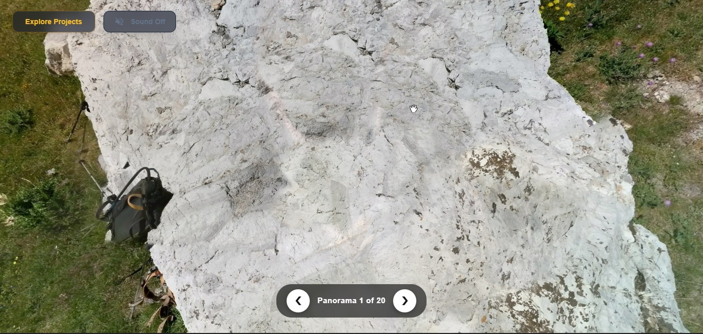
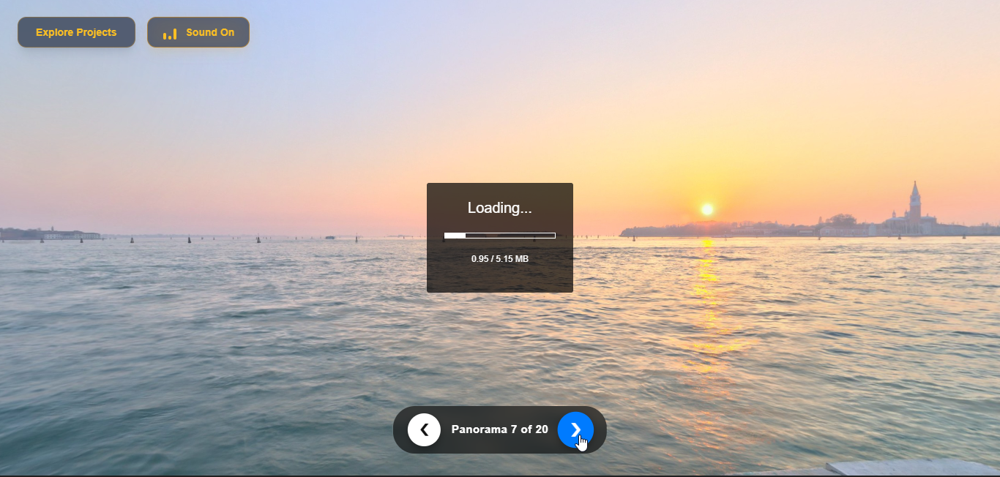
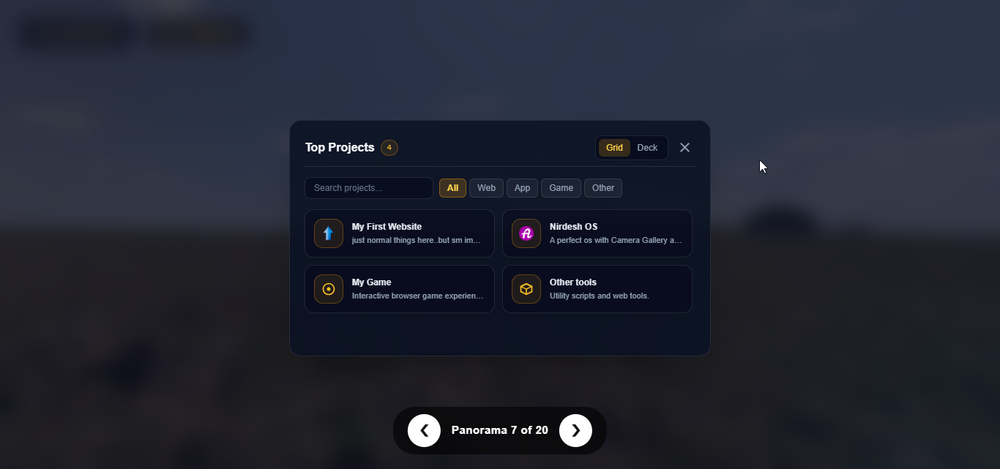
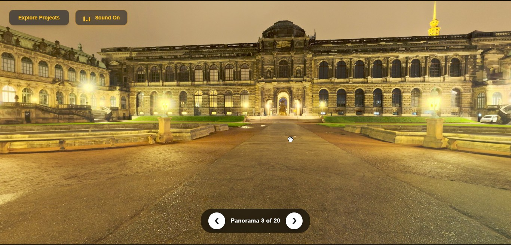
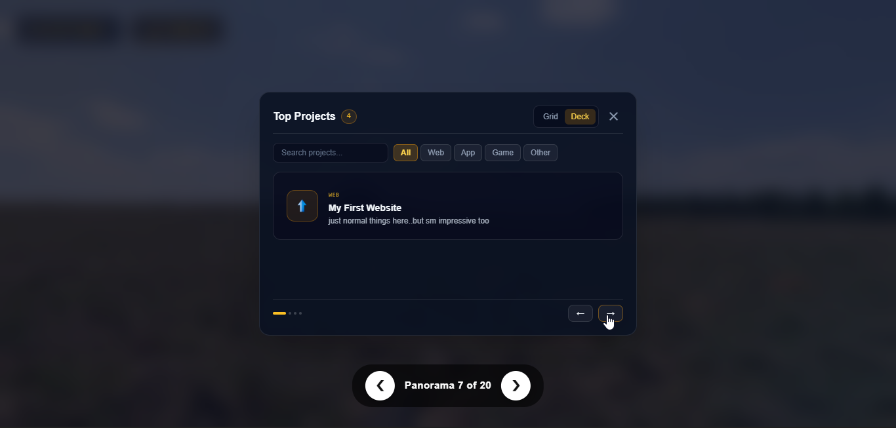

<div align="center">

# OBLIVION

<p>
  A place for my projects and experiments.
</p>

<br>

<a href="https://nonopepep7-maker.github.io/Oblivon/">
  
</a>

<br><br>


<br><br>

<sub>
  <a href="https://nonopepep7-maker.github.io/Oblivon/">nonopepep7-maker.github.io/Oblivon/</a>
</sub>

</div>

---

## What is Oblivion?

Oblivion is where I keep some of the web things I make.

The homepage is a 360° scene with a small project browser sitting on top of it. You can look around, move between scenes, open the project list, search through it, switch views, and turn the music on when you feel like it.

It started as a simple web experiment and turned into a place to collect the other experiments too.

---

## Take a look

<div align="center">

<a href="./view/brave_0hrxKmbvID.jpg">
  
</a>

<br><br>

<table>
<tr>

<td width="50%" valign="top" align="center">

<a href="./view/brave_QB4eU7CxbZ.png">
  
</a>

<br>

<strong>Loading view</strong>

<br>

<sub>The first thing you see.</sub>

</td>

<td width="50%" valign="top" align="center">

<a href="./view/brave_sKqfd430Uj.png">
  
</a>

<br>

<strong>Grid view</strong>

<br>

<sub>A quick look at the projects.</sub>

</td>

</tr>

<tr>

<td width="50%" valign="top" align="center">

<a href="./view/brave_vPttT0Csoq.jpg">
  
</a>

<br>

<strong>Homepage</strong>

<br>

<sub>The main scene and controls.</sub>

</td>

<td width="50%" valign="top" align="center">

<a href="./view/brave_yjykXH0NY9.png">
  
</a>

<br>

<strong>Deck view</strong>

<br>

<sub>Browse one project at a time.</sub>

</td>

</tr>
</table>

<br>

<sub>Click an image to see the full screenshot.</sub>

</div>

---

## Things you can do

**Look around**

There are 20 panorama scenes, and the arrows let you move between them.

**Browse projects**

Open the project panel to see the things collected there.

**Search**

Type a project name or part of its description.

**Filter**

Use the categories to narrow the list down.

**Switch views**

Grid works well when you want to see everything. Deck is better when you want to focus on one project.

**Turn the sound on**

There is background music, but it stays off whenever you don't want it.

---

## Controls

| Control                    | Action                        |
| -------------------------- | ----------------------------- |
| `Explore Projects`         | Opens the project browser     |
| `Grid`                     | Shows projects in a grid      |
| `Deck`                     | Shows one project at a time   |
| `Search`                   | Searches the project list     |
| `Categories`               | Filters the projects          |
| `←` `→`                    | Changes the panorama          |
| `Arrow Left` `Arrow Right` | Moves through Deck view       |
| `Sound On / Off`           | Controls the background music |
| `Esc`                      | Closes the project panel      |

---

## Project structure

```text
.
├── view/
│   ├── brave_0hrxKmbvID.jpg
│   ├── brave_QB4eU7CxbZ.png
│   ├── brave_sKqfd430Uj.png
│   ├── brave_vPttT0Csoq.jpg
│   └── brave_yjykXH0NY9.png
│
├── bgm.mp3
├── bgm.ogg
├── index.html
├── README.md
└── script.js
```

The `view` folder contains the screenshots used here.

`index.html` is the page itself.

`script.js` contains the panorama scenes, project list, filters, search, and project navigation.

The two audio files are used for the background music.

---

## How it was made

The page is just HTML, CSS, and JavaScript.

**Pannellum** handles the 360° viewer, while **Tailwind CSS** is used for some of the interface styling.

The project list is kept in JavaScript rather than being written out as static HTML. That makes the search, categories, and Grid / Deck views much easier to manage.

No build system is needed.

---

## Run it yourself

Clone the repository:

```bash
git clone https://github.com/nonopepep7-maker/Oblivon.git
```

Open the folder:

```bash
cd Oblivon
```

Then open:

```text
index.html
```

You can also use VS Code with Live Server.

Some parts of the page load remote libraries and panorama images, so the full experience needs an internet connection.

---

## Add a project

Open `script.js` and find:

```javascript
const projects = [
    // ...
];
```

Add a project like this:

```javascript
{
    cat: 'Web',
    title: 'My Project',
    desc: 'A short description.',
    icon: '',
    url: 'https://example.com'
}
```

Save it, refresh the page, and it will appear in the project browser.

---

## Add another panorama

Panorama entries are kept in the scene list:

```javascript
const scenesList = [
    // ...
];
```

A new entry looks like this:

```javascript
{
    id: 'scene21',
    label: 'Panorama 21 of 21',
    url: 'PANORAMA_URL'
}
```

The matching scene also needs to be added to the Pannellum configuration.

---

## Built with

* HTML5
* CSS3
* JavaScript
* [Tailwind CSS](https://tailwindcss.com/)
* [Pannellum](https://pannellum.org/)

The panorama assets are loaded from their original sources. Check their individual licenses before using them somewhere else.

---

<div align="center">

### Made by Nirdesh

Just making things and putting them here.

<br>

<a href="https://nonopepep7-maker.github.io/Oblivon/">
  <strong>Open Oblivion →</strong>
</a>

<br><br>

<sub>Thanks for looking around.</sub>

</div>
